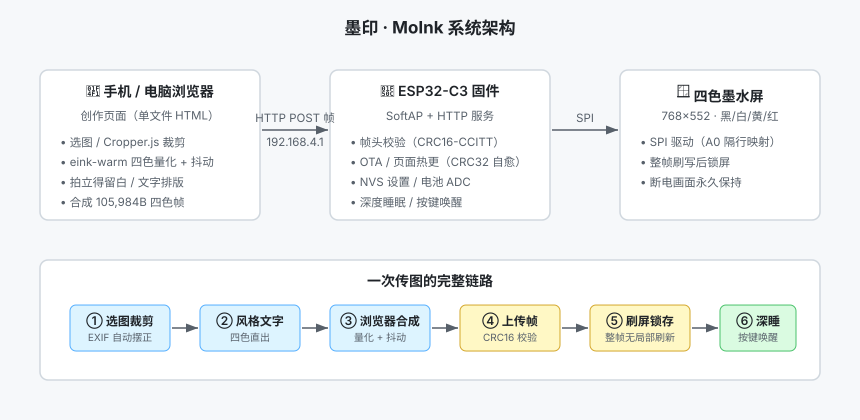
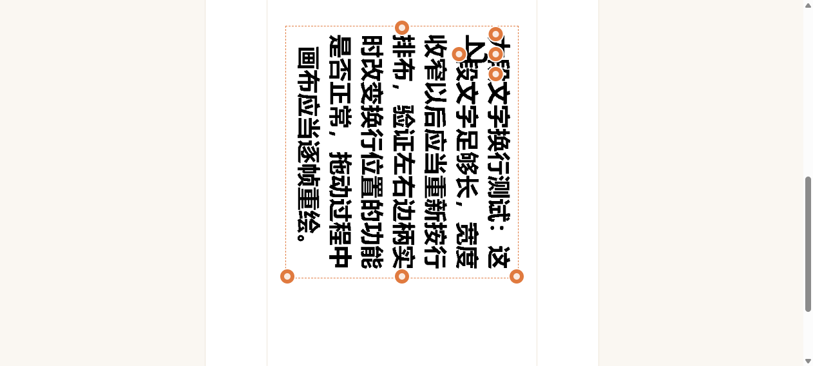

# 墨印 · MoInk 新手入门教程

> 目标：从零开始，把你的第一张照片显示在墨水屏上。
> 全程大约需要 40 分钟（含工具链安装 20 分钟）。

## 目录

1. [准备硬件](#1-准备硬件)
2. [安装开发环境](#2-安装开发环境)
3. [编译固件](#3-编译固件)
4. [给设备刷机](#4-给设备刷机)
5. [连接热点](#5-连接热点)
6. [上传第一张照片](#6-上传第一张照片)
7. [进阶：统一升级入口](#7-进阶统一升级入口)
8. [常见问题](#8-常见问题)

---

## 系统总览

开始之前，先通过架构图了解整个系统的分工——**所有图像处理都在浏览器完成，设备只负责收帧和刷屏**：



---

## 1. 准备硬件

| 部件 | 说明 |
|------|------|
| ESP32-C3 SUPERMINI 开发板 ×1 | 注意是 **C3**，其他型号引脚不兼容 |
| 768×552 四色墨水屏 ×1 | 黑/白/黄/红，2bpp 驱动（华为拆机屏） |
| USB 数据线 ×1 | 板载 USB-Serial/JTAG，普通 Type-C 数据线即可 |
| 杜邦线若干 | 按下表连接屏幕 |
| （可选）锂电池 | 接 GPIO0 ADC 分压（470k:100k）可显示电量 |

**屏幕接线表**（固件已锁定，不可改动）：

| 屏幕引脚 | ESP32-C3 引脚 |
|----------|---------------|
| SCK | GPIO4 |
| MOSI | GPIO6 |
| CS | GPIO7 |
| DC | GPIO1 |
| RST | GPIO3 |
| BUSY | GPIO10 |
| 3.3V / GND | 3.3V / GND |

**唤醒按键**（可选）：GPIO5 接按键到 GND，低电平有效；长按 5 秒恢复出厂设置。

---

## 2. 安装开发环境

### 2.1 安装 Python（3.9+）

从 [python.org](https://www.python.org/downloads/) 下载安装，安装时勾选 **Add Python to PATH**。

### 2.2 安装 PlatformIO

```bash
pip install platformio
```

验证：

```bash
python -m platformio --version
```

> 💡 也可以用 VS Code + PlatformIO 插件，图形界面更友好；本教程用命令行演示。

---

## 3. 编译固件

### 3.1 克隆项目

```bash
git clone <仓库地址> moink
cd moink
```

### 3.2 编译

```bash
python -m platformio run -e moink
```

编译成功标志：日志末尾出现 `RAM:` / `Flash:` 占用行，且无 error。

> ⚠️ **Windows 中文系统注意**：如果编译末尾报 `UnicodeDecodeError`（partitions.csv 解码失败），请加环境变量重试——分区表含 UTF-8 中文注释：
>
> **PowerShell**：
> ```powershell
> $env:PYTHONUTF8="1"
> python -m platformio run -e moink
> ```
> **Linux / macOS**：
> ```bash
> PYTHONUTF8=1 python -m platformio run -e moink
> ```

### 3.3 内嵌页面说明

固件内部嵌了一份创作页面（`src/index_html.h`，由 `page/index.html` 生成）。**修改页面后必须重新生成**再编译：

```bash
python tools/make_index_header.py
python -m platformio run -e moink
```

---

## 4. 给设备刷机

### 方式 A：一键刷机包（推荐新手，免编译）

项目自带 `flash_kit/` 目录，内含预编译固件和一键脚本：

1. 用 USB 线连接开发板
2. 双击运行 `flash_kit/MoInk一键刷机.bat`
3. 等待进度走完，显示 ✅ 即成功

### 方式 B：命令行刷机

```bash
python tools/flash_moink.py
```

### 刷机成功标志

- 屏幕出现开机画面
- 手机 WiFi 列表出现热点 **`MoInk-XXXX`**（XXXX 是设备 MAC 后 2 字节，每台设备不同）

> ⚠️ **刷机排障**：若使用浏览器网页烧录器卡在 `Stub running...`（一个字节都没写进去），拔插 USB 即可恢复，然后改用上面的命令行方式（esptool 能正确处理 C3 的 USB-JTAG 握手）。

---

## 5. 连接热点

1. 手机打开 WiFi 设置，连接 **`MoInk-XXXX`**（默认无密码）
2. 大部分手机会**自动弹出**创作页面（captive portal）；没有弹出的话，打开浏览器访问：

   ```
   http://192.168.4.1
   ```

3. 看到如下界面即连接成功（右上角连接状态显示绿点）：



> 💡 进阶：在设备设置 →「局域网连接」里填你家 WiFi，设备连入路由器后，同一局域网内用它的 IP 也能打开创作页（不用每次切热点）。

页面分为两个区域：**左侧/上方是创作控制区**（模式选择、裁剪、风格、文字），**右侧/下方是预览与上传区**（桌面端预览固定悬浮，调参数实时看效果）。

---

## 6. 上传第一张照片

页面顶部有三个并排的**内容 tab**：**拍立得 / 待办 / 轮播** —— 它们管的都是「屏幕上放什么」，
所以都在首页，不用进设置。右上角 **⚙** 才是设备怎么运行（休眠、热点、日历节奏、升级）。

### 6.1 拍立得（首页 tab ①，默认）

1. **① 选图**：点击「选择图片」，从相册挑一张照片（竖版效果最佳——页面默认竖屏构图）
2. **② 裁剪调整**：拖动裁剪框构图；双指捏合缩放、旋转；不满意可 90° 快速旋转
   - 手机直拍的照片会**自动按 EXIF 摆正方向**
3. **③ 风格与文字**（均可跳过）：
   - 风格：默认「自然暖调」适合大多数人像与食物照片
   - 留白：勾选四边可加拍立得白边（默认上下 200px / 左右 100px，可自定义）
   - 文字：勾选「添加文字」→ 输入内容 → 点「＋添加」→ 拖动手柄调整（右下缩放、右上旋转、左下调宽窄、左上红点删除）
4. **④ 上传**：点击「上传并刷新屏幕」，等待「已上传，屏幕刷新中…」提示

屏幕白屏闪烁几次属于**正常刷屏过程**（四色屏需要多轮振荡显色），几秒后画面稳定。

### 6.2 待办清单（首页 tab ②）

R1.5.0 起新增，**取代原「便签」模式**（便签那份文字会自动并进拍立得，不丢字）：

1. 在「新待办」里写一句（最多 20 个字）→ 点「**添加**」（或按回车）→ 清单里多一行；
2. 做完的直接在行首**打勾**（会画成实心方块 + 删除线），可上移 / 下移 / 删除；
3. 「**版式**」选 A 横线条目表（黑牌 + 分隔线 + 底部完成方点）或 B 红色时间轴（红脊 + 当前项黄底）；
   「**牌头语言**」只管日期与「已完成」这类固定文字，条目内容照你输入的显示；
4. 默认勾着「**勾选即上屏**」—— 每次改动都自动重排并上屏（整屏刷新约 10~20 秒）。想只存不上屏就把它取消，
   改完点「**立即上屏**」。

清单**存在设备里**，不存在手机浏览器：换一台手机打开控制页，读回的是同一份清单与同一个勾选进度。
上限 12 条 × 每条 20 字；画面上的日期取**手机上的今天**，所以不需要先同步设备日期。
**待办不参与相册轮播**，也不会让设备自己醒来 —— 你改一次、它上屏一次。

### 6.3 相册轮播（首页 tab ③）

1. 先在「拍立得」里把想要的那张传上屏（或直接用待办画面）；
2. 切到「轮播」→「**把当前画面加入轮播**」，最多 8 张；
3. 设「**换图间隔**」（分钟，`0` = 不自动换图，非 0 时**最短 5 分钟**）与播放顺序（顺序 / 随机）→「保存轮播设置」。
   为什么是 5 分钟：换一张 = 一次冷启动 + 一次四色全屏刷新（实测十几二十几秒），再快就连「刷完 + 睡下 + 醒来判断」
   这一圈都排不开，节奏会退化、电池也扛不住。R1.5.6 起页面与设备端都会挡；旧设备 NVS 里存着的 1 分钟，开机自动抬到 5 分钟。
4. 到点设备自己醒来、显示下一张，然后**约 15 秒内自己回深睡**（R1.5.7①：换完不再等满整段等人窗口）。
   两种情形分开看：一拍恰好在开机那一刻到期 → 全程**不开热点**；一拍在开机十几秒后才成熟（更常见）→
   这一趟热点会开那几十秒再睡。设备本来就醒着（比如你开着页面）时当场换那张（R1.5.6）。
   **R1.5.7② 之后还有一种情形**：醒来时这一拍还差两三分钟 → 它**什么也不做，几秒内再睡回去**，
   所以你可能连着几次连不上设备而屏幕没变化，这是正常的（到点照样换那张）。
   手动「立即换下一张」会把下一次自动换图顺延一个完整间隔。**别开着页面等它换图** —— 换完它很快就睡，
   连不上时按一下机身按键或重新上电即可。

### 6.4 设备设置

主页右上角 **⚙** 进入设备设置（这里只管设备怎么运行，画面内容在首页三个 tab）：

| 设置 | 说明 |
|------|------|
| 设备信息 | 版本（当前生效）/接口、热点名、局域网 IP、电池电压、下次自动醒来还有多久 |
| 休眠唤醒 | 传图完成后自动深睡的延时；「自动唤醒」= 每隔多少分钟自己醒来**开热点等人传图**（0~1440 分钟自由填，0 = 关闭） |
| 局域网连接 | 让设备连入你家路由器 WiFi，同一局域网内用 IP 直接访问创作页 |
| 日历自动改日期 | 勾上后设备每天到你定的时刻（默认 00:01）自己醒来把竖版日历上屏；含「日历语言（中文 / English）」「**日历样式（暖纸 / 红格 / 翻页牌 / 打卡点阵）**」「同步今天日期」「立即显示今天」 |
| 热点设置 | 修改热点名称与密码 |
| 系统维护 | 清理残影（黑白闪刷 2 次）、上传并升级（固件 / 控制页）、恢复内置页面、恢复出厂 |

> 「不休眠」不等于永不入睡：只要开了任一节奏（开热点等人 / 轮播换图 / 日历改日期），
> 设备空闲约 3 分钟后照样会深睡 —— 否则定时器根本没被武装，节奏一次也不会触发。

### 6.5 挂历用法：让它每天自己动

想把设备当墙上日历用（R1.5.0 起支持）：

1. 设备设置 → **日历自动改日期** →「同步今天日期」（设备自己没有时钟，日期靠页面推给它）；
2. 点「**立即显示今天**」→ 约 15~25 秒后屏上是竖版日历。四套样式都在「日历样式」里选，**都是竖版**：
   **暖纸**（圆角黄块 + 无框月格 + 今日黑色实心圆反白 + 节假日红点）、
   **红格**（超大红日期 + 大圆角外框月格 + 今日圆角红底 + 节假日圆角黄底）、
   **翻页牌**（黑瓷砖大日期 + 竖列月格 + 红字年与星期 + 芥末色带）、
   **打卡点阵**（黑底头部牌 + 每行 5 个日期圆点，今日实心红点）。
   想换英文就在「日历语言」里选 English —— 日历开着时保存会立刻按新语言 / 样式重排，
   关着时只存设置、不动当前画面；）
3. 勾「自动改日期」，「换日时刻」填一个每天的时刻（默认 `00:01`）→「保存日历设置」；
4. 之后**不用再管**：到点设备自己醒来上屏新日期、立刻回深睡，不开热点、不联网。
   「下次改日期」显示的是设备自己的倒计时，不是你手机算出来的。

想同时用轮播换图？两个节奏都靠同一块屏，**同一次唤醒只显示一件事**（日历优先），
后上屏的会盖掉先上屏的 —— 建议二选一。

> 设备**断过电**日期就丢了：这时它不会上屏错误日期，自动改日期会停住。
> 重新打开一次设备页就会自动补回日期（页面看到设备没同步会静默推一次）。

---

## 7. 进阶：统一升级入口

MoInk 从 R1.2.0 起**只有一个升级入口**：设备设置 → **系统维护与升级** → ① 升级。选好文件点「上传并升级」即可，**不需要判断**这次升的是固件还是控制页 —— 设备会按文件内容自动识别。

| 上传的文件 | 设备会做什么 | 耗时 |
|------|------|------|
| `moink_R1.5.7_app.bin`（固件） | 写入备用分区 → 校验 → 切槽 → **顺带更新控制页** → **重置 6 项显示 / 休眠参数**（热点名/密码、局域网配置、轮播画面与轮播/日历设置保留）→ 自动重启 | 约 1 分钟 |
| `page-R1.5.7.html`（控制页） | CRC32 校验 → 只替换控制页 → **不重启**，刷新浏览器即可 | 数秒 |

- 控制页热更存在独立 web 分区，**校验失败会自动回退内嵌页**，不会变砖；
  想手动回退用同页面的「恢复内置页面」按钮。
- 固件升级采用**双分区方案**，刷失败可回滚。
- **版本号只有一套**：固件与控制页共用同一个版本号（页脚与设备信息里显示的就是它）。
  若控制页被单独热更过，设备信息里的「版本」显示的是**当前生效的控制页版本**；
  它**低于固件版本**时会标红，提示重新上传固件把两者对齐。
- 设备信息里的「**接口**」是帧格式契约号，与版本号无关 —— 它变了才必须刷固件。

---

## 8. 常见问题

**Q：上传时提示「网络错误：请确认已连接设备热点」？**
手机可能自动切回了移动数据/家庭 WiFi。连接 MoInk 热点后，部分手机需要在 WiFi 高级设置里关闭「自动切换网络」，或在上传时临时关闭移动数据。

**Q：屏幕画面有残影 / 底色发灰？**
设备设置 → 系统维护 → **清理残影**（黑白全屏闪刷约 40~60 秒）。

**Q：刷机后不出热点、按键无反应？**
大概率是网页烧录器卡死（芯片停在 stub 里）。**拔插一次 USB** 即可恢复，然后改用命令行 `flash_moink.py` 刷机。若电脑识别不到串口，注意跳过无 VID 的虚拟串口（如蓝牙串行 COM 口）。

**Q：黄色/红色显示不对？**
色码映射已按实测标定锁定（0x02=黄、0x03=红），请勿自行修改驱动；如怀疑屏幕型号不同，先看 `docs/CONTRACT.md`。

**Q：想修改创作页面？**
编辑 `page/index.html`（单文件包含全部 CSS/JS），本地打开即可调试；改完跑门禁：
```bash
node tools/smoke_page.js          # 页面结构冒烟测试
python tools/check_algo.py        # 图像算法冻结比对（必须 12/12 MATCH）
python tools/make_index_header.py # 重新生成固件内嵌页
```

**Q：待办清单存在哪里？换手机 / 升级固件会丢吗？**
存在**设备**的 NVS 里（键 `todo_doc`，就是页面写进去的那份 JSON 原文）。换手机打开控制页读回的是同一份；
**固件升级也保留**。只有「恢复出厂」或长按按键会把清单连同轮播画面、日历设置一起清空。
页面下方那行计数会实时显示「几条 / 已完成几 / 占了多少字节」，上限 1536 字节。

**Q：开了相册轮播，但设备不换图？**
先看轮播面板里的「换图间隔」是不是 0（0 = 不自动换图）—— R1.5.0 起换图间隔**独立**设置，不再跟「自动唤醒」共用；
R1.5.6 起非 0 时**最短 5 分钟**（旧设备存的小值开机会自动抬到 5 分钟）。到点之后：设备正睡着会自己醒来换一张，
设备正醒着（比如你开着控制页）就当场换一张（R1.5.6 新增），换完约 15 秒内回深睡（R1.5.7），
所以休眠档位选「不休眠」也可以（开了节奏时空闲 3 分钟后仍会深睡，R1.4.0 的死角已修）。另外按键唤醒只进管理页、不换图（设计如此）。
R1.5.6 之前那条「不管设 1 分钟还是 10 分钟都像 10 分钟」的现象见 CHANGELOG 本版条目根因说明。

**Q：日历不自己改日期？**
按这三条查：① 有没有勾「自动改日期」并保存；② 「设备日期」是不是显示「⚠ 未同步（设备掉过电）」—— 掉电后日期丢失，日历节奏会**直接停住**（绝不上屏 1970），重新打开设备页会自动补一次同步，或手动点「同步今天日期」；③ 换日时刻是「每天」的绝对时刻，**手动刷过或刚同步过的当天视为已处理**，倒计时指向明天 —— 当天想要日历请点「立即显示今天」（这是「不抢屏」设计，防止盖掉你刚传的画面）。

**Q：日历和轮播能同时开吗？**
不能 —— R1.5.2 起固件**强制互斥**（一块屏只能有一个主人）：打开其中一个，服务端顺手把另一个关掉，
并在页面反馈里告诉你关掉了谁。被关掉的那个**配置不丢**（轮播的帧列表 / 游标 / 间隔、日历的样式 / 换日时刻全保留），
再打开它就换回来。之前「两个都开着、换日当天被下一次换图盖掉」的现象已经不会再发生。

**Q：开了相册轮播 / 日历后耗电怎么算？**
到点醒来的动作（换图、上日历）干完就回深睡，比「醒来开热点等人」省得多。R1.5.7 分两刀，两刀的
实测结果都写清楚（300 秒间隔、本机 MoInk-0D10；占空比那组读数来自**串口枚举边沿**，不是 HTTP 轮询 ——
后者会把设备喂着不睡，见下）。
- **① 换完即睡**：换完图 + 请求静默 15 秒就入睡。停止一切请求后 **18 秒**设备即不可达，
  而当时下一拍还差 123 秒 —— 这条确认生效。
- **② 剩余量还很大就睡回去**：给「醒来时这一拍还差 60 秒以上」那种相位差准备的保险。立项时读到的
  「普遍早 150~190 秒、一个周期白醒 100~205 秒」后来确认是我的密集轮询把设备喂着没睡（每个读数都是
  `curl /api/info` 取的，而每个请求都把空闲窗口续满），**已撤回**。改用串口边沿采样（全程不发 HTTP）
  重测：每拍醒 **16.3 / 31.4 / 46.4 / 61.4 秒 ⇒ 约 40 秒/拍、占空比 14.3 %**，改善全部记在 ① 名下；
  剩余量实测只有 **15 / 30 / 45 秒**，够不着 ② 的 60 秒门槛 ⇒ **② 在 300 秒间隔下一次也没触发**，
  所以这里不给它记任何省电。周期本身一直是准的：相邻两拍消费时刻差 593 秒 ÷ 2 = **296.5 秒**（设 300 秒）。
**但有一点要写明**：醒来后那一拍不是在开机瞬间就到期（更常见）时，设备是带着热点干活的，
那几十秒里热点开着；只有「一拍恰好赶上开机那一刻」才是全程不开热点。具体续航仍以本机实测为准。

**Q：电池能用多久？**
传图完成后设备进入深度睡眠（电流 μA 级），墨水屏断电画面保持。具体续航取决于电池容量与传图频次，暂无实测数据（欢迎 PR 补充）。

---

*教程对应版本：R1.5.7 · 如有出入以 [CHANGELOG](CHANGELOG.md) 最新条目为准*
